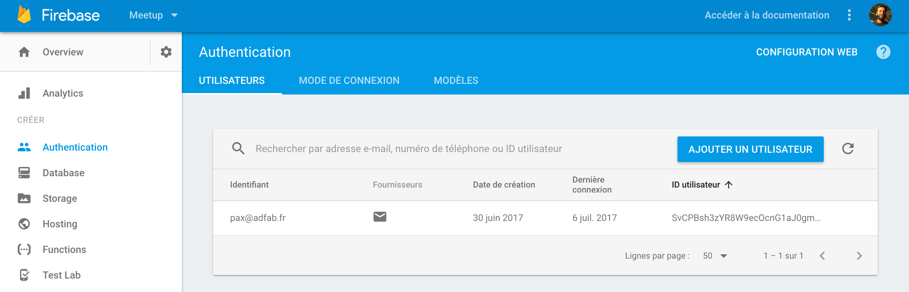

# Meetfab app

Pour utiliser l'application, vous devez créer un fichier `.env` à la racine du projet et y intégrer la configuration [firebase](https://console.firebase.google.com/) avec le contenu suivant :
```
FIREBASE_API_KEY=XXXXXXXXXXXXXXXXXX
FIREBASE_AUTH_DOMAIN=XXXXXXXXXX.firebaseapp.com
FIREBASE_DATABASE_URL=https://XXXXXXX.firebaseio.com
FIREBASE_PROJECT_ID=XXXXXXXX
FIREBASE_STORAGE_BUCKET=XXXXXXXXXX.appspot.com
FIREBASE_MESSAGING_SENDER_ID=XXXXXXXX
```

Ces infos vous seront données lors la création du service d'authentification mail d'un projet dans [firebase](https://console.firebase.google.com/)

 

```
npm install ou yarn
```
puis
```
react-native run-ios
```
